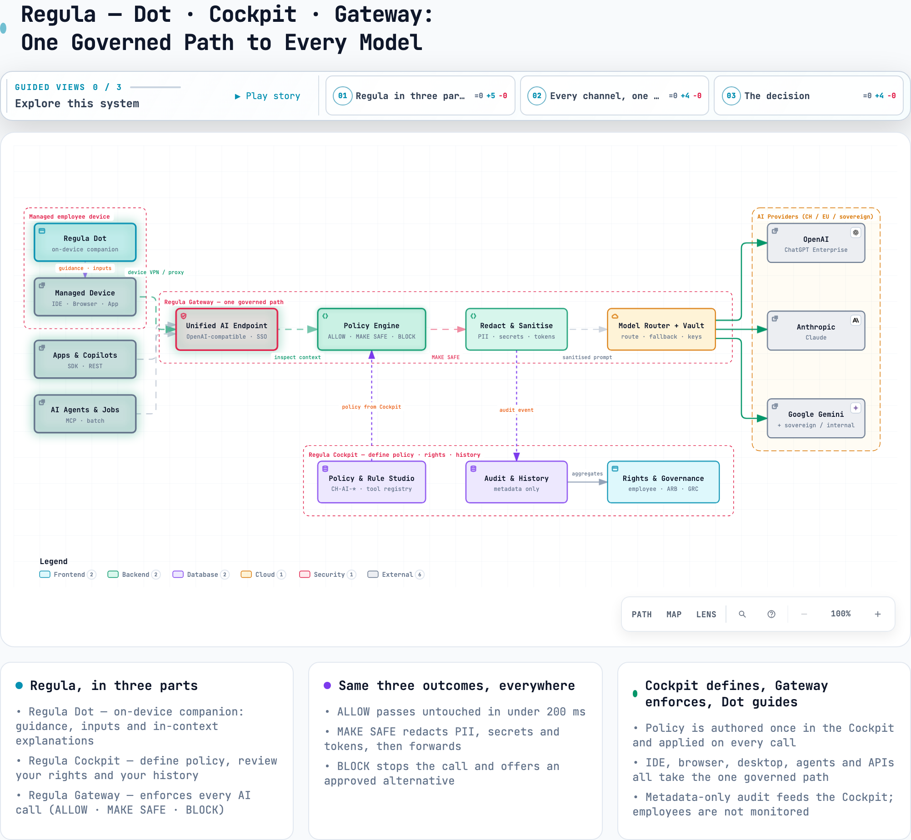

<div align="center">


# 🏦 Finnova Hackathon 2026

### 12 hours. One team. Responsible AI for Banking & Finance.

Part of **[Swiss {ai} Weeks 2026](https://ai-weeks.ch/)** — Switzerland's largest open AI movement.

<br/>

[](https://ai-weeks.ch/events/finnova-hackathon)
[](https://luma.com/kd5177ia)
[](https://www.finnova.com/)
[](https://ai-weeks.ch/)

</div>

---

## 🎯 What we're building — Regula

Banks want employees to use AI, safely. Today that means people reading policies and
guessing what is allowed. **Regula turns AI governance into infrastructure**: every AI
interaction is automatically **ALLOWED**, **MADE SAFE** or **BLOCKED** against Finnova
policy — so the employee never has to interpret the rules.

> **Use AI where you want. Governance follows you.**

Regula is the pink full stop of the finnova logo, in three parts:

| Component | What it is | Its job |
|---|---|---|
| **regula.dot** | On-device companion — a macOS menu-bar dot + opt-in desktop pet, and the in-browser extension | Guides the user, collects inputs and explains every decision; never lets prompt content leave uninspected |
| **regula.cockpit** | Web cockpit + policy service | Where policy is **defined** and each user reviews their **rights and history** (employee + governance views) |
| **regula.gateway** | AI gateway (concept) | Enforces the same policy on **every** call — browser, IDE, agent, API |

**One rule set, everywhere.** Policy is authored once in the cockpit and enforced by the
dot on the device today; the gateway extends the same enforcement to servers, agents and
APIs.

---

## 🏗️ Architecture

<div align="center">

</div>

**One governed path.** The managed device, apps, agents and APIs all reach a single
endpoint: the **cockpit** defines the policy, the **gateway** enforces **ALLOW · MAKE
SAFE · BLOCK** before anything reaches a provider, and **dot** guides the user and logs
metadata-only evidence back to the cockpit.

Interactive diagrams (pan/zoom, guided views) and the write-ups:
[high-level architecture](docs/pitch/regula-ai-gateway.html) ·
[device enforcement](docs/pitch/regula-ai-gateway-enforcement.html) ·
[Regula PRD](docs/prd/regula-ai-gateway.md) ·
[AI Guard PRD](docs/prd/finnova-ai-guard-prd.md)

---

## 📍 At a Glance

**Finnova Hackathon** — a 12-hour AI build sprint. **Fri 18 Sep 2026**, Finnova AG Bankware HQ, Lenzburg 🇨🇭. Part of [Swiss {ai} Weeks 2026](https://ai-weeks.ch/). Tracks: Banking & Finance · Freestyle. Tokens, rooms and the final agenda live on the official pages — treat those as the source of truth.

**Links:** [Event](https://ai-weeks.ch/events/finnova-hackathon) · [Challenges](https://swamp-shake-7d9.notion.site/Challenges-247ac535de758095b85dea6ede1adaaa) (pick one before Friday) · [Tools](https://swamp-shake-7d9.notion.site/Tools-26aac535de7580b689e6edc66e16a4a0) (check what's provided first) · [Synthesia](https://www.synthesia.io) (pitch video)

**Rules of thumb:** Demo > architecture · scope down twice · Responsible AI is a judging lens, not a footnote.

---

## 🚀 Getting Started

### Installing regula.cockpit manually (step by step)

**regula.cockpit** is the governance cockpit plus the policy service behind it.
Everything runs on your Mac; nothing is deployed. Allow about five minutes.

**Prerequisites**

- macOS (the hostname step uses `pf`, which is macOS only; on Linux use `iptables` instead)
- **Node 24+** and npm (`node --version`). The code is TypeScript and Node runs
  it directly, so there is no compile step for the service.
- Git and, for the extension later, Google Chrome

**1. Clone the repository**

```bash
git clone https://github.com/elm1nst3r/FinnovaHackathon2026.git
cd FinnovaHackathon2026
```

**2. Install dependencies**

```bash
npm install
```

This only pulls dev tooling (esbuild, TypeScript, type definitions). The
service itself has no runtime dependencies.

**3. Build the cockpit bundle**

```bash
npm run build:web
```

This writes the cockpit into `public/` and the unpacked browser extension into
`dist/extension/`. Both folders are generated and git-ignored; rerun this step
after every change under `src/cockpit/` or `src/extension/`.

**4. Start the policy service**

```bash
npm run serve
```

You should see:

```text
AI Guard policy service on http://127.0.0.1:8787
Mocked identity: send x-aig-user: u-anna | u-luca | u-sara
```

The service binds to loopback only. Set `PORT=<n>` to use another port.

**5. Check it in the browser**

Open <http://127.0.0.1:8787/>. The cockpit loads with the mocked identity
picker in the header. If you only want to click around the cockpit, you are
done. Continue for the demo hostname the extension expects.

**6. Make it reachable as `cockpit.finnova.local`**

The extension and the demo address the cockpit by name at
<http://cockpit.finnova.local/> on port 80. Two things need root:
a hosts entry and a redirect from port 80 to the unprivileged service on 8787.

Either run the helper once (it asks for sudo):

```bash
scripts/local-host.sh up
```

or do the same by hand:

1. Add the hosts entry:

   ```bash
   echo "127.0.0.1 cockpit.finnova.local" | sudo tee -a /etc/hosts
   ```

2. Redirect port 80 to 8787 on the loopback interface:

   ```bash
   echo "rdr pass on lo0 inet proto tcp from any to 127.0.0.1 port 80 -> 127.0.0.1 port 8787" | sudo pfctl -ef -
   ```

   The message `pf already enabled` is harmless.

3. Keep `npm run serve` running (or start it again) and open
   <http://cockpit.finnova.local/>.

Without the redirect, `sudo PORT=80 npm run serve` also works, at the cost of
running Node as root.

**7. Verify**

```bash
curl -s -o /dev/null -w "%{http_code}\n" http://cockpit.finnova.local/     # expect 200
npm run typecheck     # tsc --noEmit
npm test              # node --test
```

**Stopping and uninstalling**

- Stop the service with `Ctrl+C`. State is held in memory and reseeded from
  `src/fixtures/` on the next start, so there is nothing to clean up.
- Remove the port redirect with `scripts/local-host.sh down`, or by hand with
  `sudo pfctl -F all -f /etc/pf.conf && sudo pfctl -d`. The hosts entry stays;
  delete the `cockpit.finnova.local` line from `/etc/hosts` if you want it gone.
- Delete the generated folders with `rm -rf public dist`.

**Troubleshooting**

- *Port 8787 in use*: run with `PORT=8788 npm run serve` and pass the same
  `PORT` to `scripts/local-host.sh up`.
- *`cockpit.finnova.local` does not resolve*: check that the line is in
  `/etc/hosts` and that the browser is not using a DNS-over-HTTPS resolver that
  bypasses the hosts file.
- *Cockpit shows a blank page or 404*: `public/` is missing; rerun
  `npm run build:web`.
- *Personas all look the same*: identity is mocked per request, see the table
  below.

### Demo personas

Identity is mocked: use the **demo identity** picker in the header to switch persona.

| Persona | Sees |
|---|---|
| **Anna Berger** | Employee view only |
| **Luca Moretti** | Employee view only |
| **Sara Keller** | Employee **and** governance view (`ai-governance` group) |

Switching persona is not a privilege escalation trick — the server re-derives
group membership on every request, so an employee calling a governance
endpoint directly is still refused.

### Loading the browser extension

The enforcement point is a Chrome MV3 extension. It is what actually sees a
prompt; the cockpit never does.

1. `chrome://extensions` → enable **Developer mode**
2. **Load unpacked** → select `dist/extension/`
3. Open ChatGPT, Copilot or Gemini and type something with an IBAN or a name in it

The extension talks to `http://cockpit.finnova.local`, so the service must be
running behind that name the first time (step 6 above). After that it works
from its own cache — stop the service and it keeps enforcing the last known
good policy set, flagging the age once the cache passes 24 hours.

---

## 🗂️ Repo Structure

```text
.
├── docs/
│   ├── prd/            # Product requirement documents  → see docs/prd/README.md
│   └── pitch/          # Architecture diagrams, demo script, pitch assets
├── openspec/           # Change specs driving the implementation
├── assets/dot/         # "Dot" mascot — SVGs, Lottie animations, README media
├── regula/             # regula.dot — Tauri 2 desktop / menu-bar companion
├── src/
│   ├── core/           # Decision engine, policy validation, exceptions — pure, no I/O
│   ├── service/        # regula.cockpit policy service: identity, store, HTTP routes
│   ├── cockpit/        # regula.cockpit web app (employee · governance)
│   ├── extension/      # regula.dot browser enforcement point (Chrome MV3)
│   └── fixtures/       # Seed data for the demo
├── test/               # node --test suites
├── .github/            # PR template
└── CONTRIBUTING.md     # Branching, commits, ground rules
```

---

## 👥 Team

- **Mattias Pliska** — [@mattias-pliska](https://github.com/mattias-pliska)
- **elm1nster** — [@elm1nst3r](https://github.com/elm1nst3r)
- **thedevil-prog** — [@thedevil-prog](https://github.com/thedevil-prog)
- **Elena** — [@kuprienko](https://github.com/kuprienko)

---

<div align="center">

**Let's build something worth demoing.** 🚀

<sub>Finnova Hackathon · Swiss {ai} Weeks 2026 · Lenzburg</sub>

</div>
