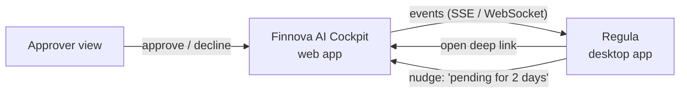
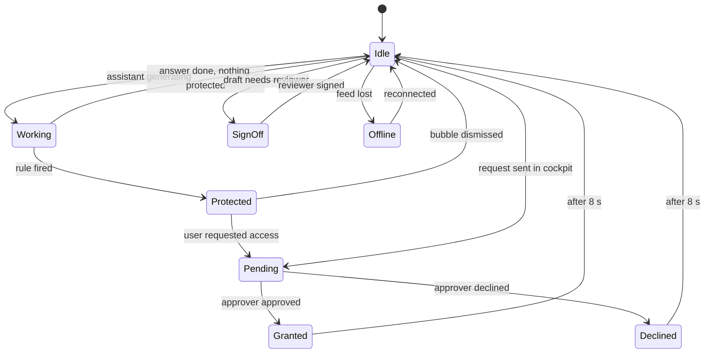
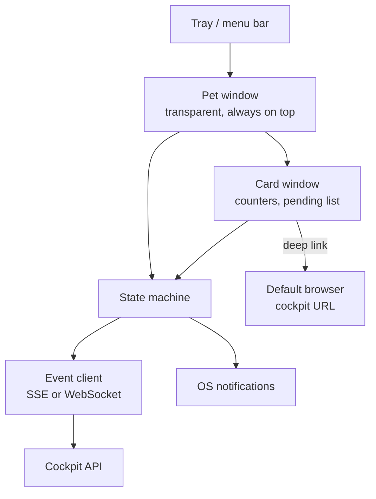

# Finnova Desktop Pet PRD

As of 2026-09-18 · Elena Kuprienko

Live copy (edit and comment there): https://claude.ai/code/artifact/64684a9c-d775-4e12-bce0-607f4329d6ab

## Summary

**Regula** is a small animated desktop companion that sits on a bank advisor's screen and mirrors the state of their Finnova AI Cockpit: it dozes when nothing is happening, perks up when the assistant is working, holds up a little shield when a rule protects something, waits visibly while an access request is with the approver, and cheers when access is granted. It is the always-visible, friendly face of the cockpit, in the spirit of the Codex desktop pet, and it never shows, stores or unmasks any client data itself.

The pet is a standalone desktop app (macOS for the POC, Windows later) for the [HackLenzburg 2026](https://claude.ai/artifact/1v8KYRJPfVDCGQUoXYAUti) cockpit prototype. The cockpit is a web app; this PRD covers the pet only. Everything the pet knows comes from a small event feed the cockpit already has (protections, requests, approvals, sign-offs, activity), so the pet adds presence and delight without adding a second place where data lives.

## Name and character

The pet is called **Regula**. It is the pink dot from the finnova logo, the full stop that ends the wordmark, with a face: two navy eyes and a small mouth on a flat pink disc, nothing else. Regula is the Latin word for rule, the root of the German "Regel", so the name says what the companion is for: it notices rules firing and requests moving. It is also a classic Swiss first name, and Regula is one of the two patron saints of Zurich, which gives the name a home in Swiss banking without a made-up word. The nerdy edge comes from the Latin: a regula was also the straightedge a scribe ruled lines with, and the Regula Benedicti is the oldest rule book still in use. Three syllables, easy in English, German, French and Italian, and short enough for a Slack message ("Regula is waiting on Jonas").

The name is the Latin noun, not the first name: the pet has no gender and the team refers to it as "it". The full stop is the right character for a governance companion: it is the mark that closes a sentence, the way a rule closes a question, and it is the one piece of the finnova brand that already looks like a creature. A pair of eyes on the advisor's desk is a second pair of eyes, and the four-eyes principle (Vier-Augen-Prinzip) is the governance idea the cockpit is built on, so the tagline is "your second pair of eyes".

Fibi was the working name before this version, when the character was still an owl. Two alternates are kept in case the name check on Regula fails or colleagues named Regula object:

| Name | Rationale | Why not first choice |
| --- | --- | --- |
| Tally | Keeps an honest count, matches the four counters; a tally stick was the first two-party, tamper-evident record | Says nothing Swiss; Tally.so and Tally accounting exist |
| Punkt | German for dot and for full stop; "Punkt." is how a Swiss bank ends a discussion | Reads as an object, not a character; no rule meaning |

Personality, in five traits the animators and copywriters work from:

- **Friendly and sympathetic.** Regula is on the advisor's side. When a rule protects something, it never scolds; it holds the shield up and looks a little apologetic.
- **Nerdy.** A tiny monospace badge that shows the rule id (for example CH-ACC-01) when it fires, eyes that squint at rule ids like a proofreader, and a habit of glancing down at an invisible ledger when idle.
- **Calm.** Movements are small and slow. A bank desk is not a game; Regula must never distract during a client call.
- **Honest.** It only ever shows states that are true in the cockpit. No fake progress, no decorative alerts.
- **Discreet.** It knows that something is protected, never what it is. That is a character trait and a security rule at the same time.

Voice for the few words Regula says (tooltips and speech bubbles, max 12 words, English and German): plain, a little dry, never emoji. Examples: "Jonas has your IBAN request.", "Granted until 30 Sep. Nice.", "One draft wants a reviewer."

## Goals and non-goals

Goals, in priority order:

1. Make cockpit state visible without opening the browser tab: the advisor knows at a glance whether the assistant is working, something was protected, a request is pending, or access was granted.
2. Cut the time between an approval and the advisor noticing it. Target: under 10 seconds from the approver's click to Regula's reaction.
3. Give the cockpit a warm, memorable face that people at HackLenzburg and later at finnova remember and talk about.
4. Provide one-click ways back into the cockpit at the right place (the pending request, the draft that needs sign-off).
5. Stay branded: Regula must look like it belongs to the Finnova AI Cockpit, using its palette and type.

Non-goals for this version:

- Regula is not a chat surface. Questions to the assistant go through the cockpit web app.
- Regula does not render, cache or unmask any client value, rule text beyond the id and label, or conversation content.
- Regula does not approve or decline requests. Approvers act in the cockpit.
- No gamification: no levels, points, feeding, or streaks. Regula's mood follows cockpit state only.
- No mobile version, no browser extension.
- No sound by default (see Brand and visual design).

## Users and personas

The personas are the ones the cockpit already uses.

| Persona | Role in cockpit | What Regula does for them |
| --- | --- | --- |
| Mira Keller | Advisor, level 1, Client Advisory | Sees when her request to Jonas moves, when a protection fired in her last answer, when a draft needs sign-off. Jumps back to the exact item. |
| Jonas Frei | Team Lead, approver | Sees a small badge when a new request lands in "Requests for you", with the count. One click opens the request. |
| Luca Bernasconi | Advisor, requested a set of 3 identity items | Same as Mira; Regula shows a set request as one item, not three. |
| Compliance / IT admin (not in the mock) | Owns the rule pack banking-ch 0.1 and desktop rollout | Needs Regula to be silent about values, installable by MDM, and switchable off per user. |

Primary persona for the hackathon demo is Mira. Jonas's approver mode is P1 and shares the same build, switched by the role the cockpit reports.

## Relationship to the cockpit

Regula is a read-mostly mirror of the cockpit. The cockpit stays the single source of truth for rules, requests, approvals and audit; Regula subscribes to its events and deep-links back.

The pet reacts to five cockpit facts and nothing else: the assistant is generating an answer, a rule protected an item in that answer, a request is waiting with an approver, a request was granted or declined, and a draft needs sign-off. State flows from the cockpit to Regula, and only navigation flows back.

What Regula mirrors:

- The four counters on "My access": open, protected, waiting for approval, granted with an end date.
- Each pending request by label and rule id, for example "Account number (IBAN), CH-ACC-01, with Jonas Frei".
- Approver mode: the count in "Requests for you" and the newest request's label.
- Activity: the last event's kind and time.

What Regula never does:

- Never shows a protected value, a masked value, or the "why" text with client context.
- Never sends a request, withdraws one, approves or declines. Every action button in Regula opens the cockpit at the right place instead.
- Never stays wrong: if the connection drops, Regula visibly goes to sleep with a small "offline" badge rather than showing stale state as current.

## Functional requirements

P0 is the hackathon demo, P1 the first pilot at finnova, P2 later.

| ID | Priority | Requirement | Acceptance |
| --- | --- | --- | --- |
| F1 | P0 | Regula is first a pink dot in the menu bar. If the user opts in ("Show Regula on the desktop"), it also runs as a small always-on-top, transparent, frameless window that the user can drag anywhere on the desktop | Dot changes with state; the opt-in is remembered; position survives restart; never steals focus; click-through from the menu |
| F2 | P0 | Regula connects to the cockpit with the user's existing session and subscribes to the event feed | Connected state within 3 s of cockpit login; reconnect with back-off; offline state shown |
| F3 | P0 | Regula shows one of the animation states for each cockpit fact: idle, working, protected, pending, granted, declined, sign-off, offline | State changes within 1 s of the event arriving |
| F4 | P0 | Hovering or clicking Regula opens a compact card: the four access counters, the pending list with rule ids, and a button per item that deep-links into the cockpit | Card fits 320 by 240 px; every button opens the matching cockpit screen |
| F5 | P0 | The menu bar dot offers Show Regula on the desktop (checkbox), Open cockpit, Pause reactions for 1 h, Quit, and shows the number of items waiting on the user | Pause is visible on the dot and on Regula (it sleeps with a badge) |
| F6 | P0 | Speech bubble on state change with a short sentence (max 12 words), auto-hides after 6 s | No bubble while Pause is on; never contains a value |
| F7 | P1 | Approver mode: when the cockpit reports the approver role, Regula shows the count of open requests and the newest request label | Badge count matches the cockpit within 10 s |
| F8 | P1 | Native OS notification as a fallback when Regula is hidden, using the same wording as the bubble | Respects OS Do Not Disturb |
| F9 | P1 | Language follows the cockpit user setting: English and German | All strings in one file per language |
| F10 | P1 | Nudges: if a request has been pending longer than a configurable time (default 2 working days), Regula taps the ledger and offers "Ask Jonas?" which opens the request in the cockpit | Off by default for approvers |
| F11 | P2 | Settings: size (S, M, L), corner snapping, reduced motion, sound on or off, launch at login | Reduced motion follows the OS setting by default |
| F12 | P2 | Auto-update and MDM-friendly installer (pkg, msi) with a signed binary | Installs silently with no admin prompt for the user |

Out of scope in every phase: any input field that sends text to the assistant, any display of client values, and any action that changes an access state.

## Animation and personality spec

Regula is "a little bit" animated on purpose: one small loop per state, a short transition between states, and nothing that moves faster than a breath. The rig is a flat pink disc with two eyes and a mouth. It has no limbs, no glasses and no body, so everything is said through the face, a little squash and stretch of the disc, and at most one accessory at a time (shield, pencil, badge). The base sprite is about 96 by 96 px at 1x, delivered as a vector rig (Lottie or Rive) so it scales cleanly on retina screens and stays small on disk.

Regula starts idle, and every other state is entered by exactly one cockpit event and left either by the next event or by a timer. Pending and SignOff persist as long as the cockpit says so; the celebratory states time out.

| State | What Regula does | Loop | Bubble example |
| --- | --- | --- | --- |
| Idle | Breathes slowly (disc scales by 2 %), blinks every 4 to 7 s, eyes drift a little, glances down at an invisible ledger every ~40 s | 3 s breath | none |
| Working | Eyes narrow in concentration, a small dotted ring orbits the disc | 1.2 s | "Thinking with the assistant." |
| Protected | A small shield in the amber protect tint pops up in front of the disc; a mono badge shows the rule id; eyebrows go apologetic | shield sways 2 s | "CH-ID-01 kept the identifier masked." |
| Pending | Dashed outline around the disc, shield parked at its side, eyes look toward the top right every 10 s | 4 s | "Jonas has your IBAN request." |
| Granted | Hops once with a squash and stretch, shield turns the granted green, tiny confetti of three squares | one-shot 1.5 s then idle | "Granted until 30 Sep. Nice." |
| Declined | Disc sinks 2 px, eyes drop, mouth flattens, then a small nod | one-shot 2 s | "Jonas left a note. Open it?" |
| SignOff | A pencil leans against the disc, eyes scan left to right as if reading a line | 3 s | "One draft wants a reviewer." |
| Offline | Eyes closed, a small zzz, a grey dot badge, disc fades to the muted pink | 5 s | "Cockpit not reachable." |
| Paused | Sleeping with a small moon badge, no bubbles | 5 s | none |

Rules for the animators:

- Transitions take 300 ms with an ease-out curve. No bounce larger than 4 px, no rotation beyond 8 degrees, squash and stretch within 6 % of the diameter. The disc never stops being a circle at rest.
- Sprites use only the brand palette (next section). The disc is always the finnova pink; the shield tint is the one variable that changes with state.
- Reduced motion: keep the state poses, drop the loops to a single frame, and fade instead of hop.
- Regula never moves on its own across the screen. It stays where the user put it.
- Eye contact: Regula looks toward the cursor within a 200 px radius, subtly. This is the single "alive" touch that makes people smile in the demo.
- Every bubble is dismissable with one click; Escape closes the card.

## Brand and visual design

Regula reuses the cockpit's design tokens one to one, so the pet and the web app read as one product. The disc itself uses the two colours of the finnova logo (navy wordmark, pink full stop, taken from the published logo SVG); the rest of the palette is from the cockpit artboards, and alignment of those with the official finnova corporate identity is an open question (see the last section).

| Token | Value | Used on Regula for |
| --- | --- | --- |
| Finnova pink | #F042BE | The disc, tray icon, the one colour Regula is |
| Finnova navy | #17233B | Eyes and mouth, wordmark in the card header |
| Muted pink | #F9B6E4 | Disc while Offline or Paused |
| Ink | #16201C | Outline, card text |
| Paper | #F6F4EE | Eye whites, card background |
| Finnova green | #1F4D3A | Primary button in the card |
| Muted | #4D5651 | Secondary text, offline badge |
| Border | #DEDACF | Card border, bubble border |
| Protect tint | #FBEBC8 | Shield while Protected and Pending |
| Granted tint | #DDEFE4 | Shield after approval, confetti |
| Nav green | #2A3832 | Card header, tray icon on dark menu bars |

Type: Instrument Serif for the name "Regula" and the card title, Instrument Sans for body copy, IBM Plex Mono for rule ids and counters. The mono rule id on the shield badge is the strongest brand link back to the cockpit, where the same ids appear in the same font.

Look: flat vector, a pink disc with a navy face, one accessory at a time, soft 10 px radii on the card, no gradients, no drop shadows except a 1 px border on the card. In the tray at 16 to 22 px Regula is a plain pink dot, exactly the logo's full stop; the face appears from 48 px up. The "Finnova" wordmark appears once, in the card header, in the serif used by the cockpit nav.

Sound: off by default. If enabled, three short sounds only: a soft click on Protected, a two-note chime on Granted, a single low note on Declined. No sound for Working or Idle. Nothing plays while the OS is in Do Not Disturb.

Dark mode: Regula itself does not change (the pink disc with a navy face works on both). The card and bubble follow the OS theme by swapping Paper and Ink.

## Technical architecture

Recommended stack: **Tauri 2** (Rust shell, web view for the pet and the card), animations in **Rive** (fallback Lottie), TypeScript for the UI. Tauri gives a 5 to 10 MB binary, native transparent always-on-top windows on macOS and Windows, a tray API and a signed updater, which matters for a bank desktop. Electron is the fallback if the team is faster in it; the requirements do not change.

The tray owns the pet window, the pet and its card share one state machine, and the state machine is the only thing that talks to the cockpit.

Cockpit integration contract (to be added to the cockpit web app; this is the only backend work the pet needs):

| Piece | Shape |
| --- | --- |
| Auth | Pet opens the cockpit login in the browser once; cockpit hands back a short-lived device token by custom URL scheme `finnova-regula://auth?code=…`. Token is stored in the OS keychain. |
| Feed | `GET /api/pet/events` as Server-Sent Events, one JSON event per line, with `Last-Event-ID` for resume. |
| Event kinds | `assistant.working`, `assistant.done`, `protection.fired`, `request.sent`, `request.granted`, `request.declined`, `draft.signoff_needed`, `draft.signed`, `counters.changed`, `approver.request_received` |
| Event payload | Only: event id, kind, time, item label, rule id, approver display name, deep link, and for counters the four integers. No values, no conversation text. |
| Deep links | `http://<cockpit>/access#requests`, `/access?item=iban`, `/assistant?conv=<id>`, `/approver?request=<id>` |
| Snapshot | `GET /api/pet/state` returns the same shape as one `counters.changed` plus the pending list, used on start and after reconnect. |

Runtime behaviour: the state machine derives Regula's state purely from the latest snapshot plus the events since, so a replay always ends in the right state. Events older than 24 h are ignored. The pet stores nothing on disk except window position, settings and the keychain token.

Demo fallback for the hackathon: a local mock feed (`--mock` flag) that replays a scripted sequence matching the cockpit's story: Mira asks, CH-ID-01 fires, she requests the IBAN, Jonas approves for 30 days, the draft is signed off.

## Security, privacy and compliance

The pet lives on a bank advisor's desktop, so the rule is simple: Regula may know that something happened, never what it contains.

- **No client data on the wire or on disk.** The event schema has no field for a value, a client name, or conversation text. This is enforced in the cockpit API, not only in the pet.
- **Labels are the only text.** Item labels ("Account number (IBAN)"), rule ids (CH-ACC-01) and approver display names are the only strings Regula displays. Both already appear in the cockpit's own approver view, which shows the rule and the context but never the value.
- **Screen sharing.** Regula shows nothing an advisor would not show a client, so it is safe on a shared screen. Still, Pause hides bubbles for one hour for calls.
- **Auth.** Device token in the OS keychain, scoped to the pet feed only, revocable from the cockpit's activity page, expires with the cockpit session.
- **Transport.** TLS only; certificate pinning to the cockpit host is P1.
- **Audit.** Every deep link Regula opens is a normal cockpit page view and is logged there. The pet itself writes no audit log and no analytics beyond an opt-in crash report without payloads.
- **Least surface.** No text input, no clipboard access, no screen capture permissions, no file system access beyond its own settings folder.
- **Signed and updatable.** Notarised on macOS, Authenticode on Windows, updates over the signed Tauri updater so IT can roll out and revoke centrally.
- **Kill switch.** The cockpit can send `pet.disable` to shut the pet down remotely, for example when a rule pack changes.

## Success metrics

For the hackathon the metric is the demo: judges see Regula react to every step of Mira's story without a word of explanation. For the pilot, measured in the cockpit's activity log and a short survey:

| Metric | Target for pilot (first 4 weeks) |
| --- | --- |
| Time from approval to the advisor opening the granted item | Median under 5 minutes (today: whenever they next open the tab) |
| Share of cockpit visits that start from a Regula deep link | Above 30 % |
| Advisors who keep Regula visible after week 2 | Above 70 % of installs |
| Pause used during client calls | Present in logs; shows the feature is trusted rather than the app quit |
| Survey: "Regula feels like part of the cockpit" | 4 of 5 or better |
| Security incidents attributable to the pet | 0 |

## Milestones

| When | Milestone | Contains |
| --- | --- | --- |
| Hackathon day 1 | Regula stands | Tauri shell, transparent draggable window, tray, Idle and Working loops, mock feed |
| Hackathon day 2 | Regula reacts | All P0 states, shield with rule id, bubbles, card with counters and deep links, scripted demo sequence |
| Demo | Story run-through | Mira's flow end to end against the mock feed; real feed if the cockpit team exposes the SSE endpoint in time |
| Pilot prep, 4 weeks after | P1 | Real cockpit feed and auth, approver mode, German strings, OS notifications, nudges, signed builds |
| Pilot | 10 advisors and 2 approvers at finnova | Metrics above, weekly review, kill switch tested |
| After pilot | P2 | Settings, sizes, reduced motion, MDM installer, auto-update |

Team for the hackathon: one person on the Tauri shell and feed, one on the Rive rig and states, one on the card, copy and the demo script. The cockpit team owns the two API endpoints.

## Risks and open questions

Risks:

- **Annoyance.** A pet on a bank desk can become noise. Mitigation: small motion, no sound by default, Pause in one click, and the hide toggle in the tray. Watch the "kept visible after week 2" metric.
- **Wrong state.** A pet that celebrates a stale approval damages trust. Mitigation: snapshot on connect, explicit Offline state, events derived only from the cockpit.
- **Brand mismatch.** The cockpit palette may not be finnova's official CI. Mitigation: tokens in one file so a re-skin is a one-day job.
- **Desktop rollout.** Bank workstations are locked down. Mitigation: Tauri's small signed binary and an MDM-ready installer in P2; the pilot can run from a user-space install.
- **Cockpit dependency.** Without the feed endpoint, Regula is a demo only. Mitigation: mock feed for the hackathon, endpoint spec above so the cockpit team can build it in parallel.

Open questions:

- [ ] Is "Regula" free to use as a product name at finnova, or do we take Tally or Kauz?
- [ ] Does the name land as a wink with colleagues called Regula? Ask two of them before the pilot.
- [ ] Which finnova CI colours and fonts should replace the cockpit's placeholder palette?
- [ ] Does the cockpit team accept the SSE feed and device-token flow, or should the pet reuse the cockpit's existing session cookie through a system web view?
- [ ] Should approvers get Regula at all in the pilot, or only advisors?
- [ ] Windows first or macOS first for the pilot machines?
